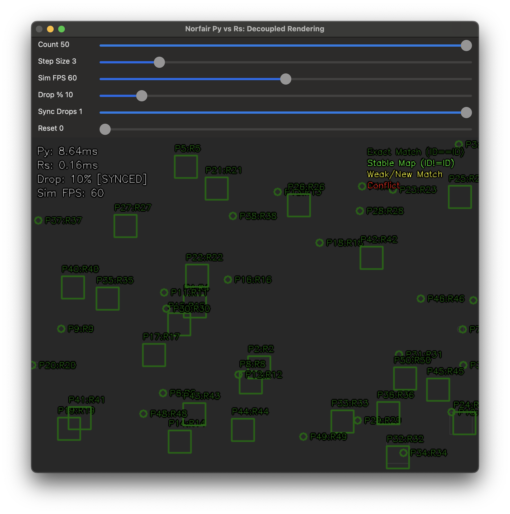

## norfair-rs

**Real-time multi-object tracking for Rust**

[](LICENSE)
[](https://crates.io/crates/norfair-rs)
[](https://pypi.org/project/norfair-rs/)
[](https://pypi.org/project/norfair-rs/)
[](https://www.rust-lang.org)

---

> **Disclaimer:** This is an unofficial Rust port of Python's [norfair](https://github.com/tryolabs/norfair) object tracking library. This project is **NOT** affiliated with, endorsed by, or associated with Tryolabs or the original norfair development team. All credit for the original design and algorithms goes to the original norfair authors.

---

## Overview

**norfair-rs** is a Rust implementation of the norfair multi-object tracking library, bringing real-time object tracking capabilities to Rust applications with:

- **Detector-agnostic design:** Works with any object detector (YOLO, Faster R-CNN, custom models)
- **Rust-native performance:** Zero-cost abstractions, no GC, maximum speed
- **Type-safe API:** Compile-time validation of tracking configurations
- **Comprehensive Tests:** 289+ Rust tests + 98 Python tests ensuring correctness and equivalence with the original norfair library
- **Drop-In-Replacement**: Python bindings with `uv add norfair_rs` and `import norfair_rs as norfair`

### Related Projects

- **[norfair](https://github.com/tryolabs/norfair)** - Original Python implementation by Tryolabs
- **[norfair-go](https://github.com/nmichlo/norfair-go)** - Go port of norfair (sibling project)

### Features

- **Flexible Distance Functions:** IoU, Euclidean, Manhattan, Frobenius, Keypoint Voting, and more
- **Multiple Filtering Options:** Optimized Kalman filter, full filterpy-equivalent Kalman, or no filtering
- **Re-identification (ReID):** Full support for object re-identification with `reid_hit_counter` lifecycle
- **Thread-safe:** Concurrent-safe ID generation and tracking
- **Python Callable Support:** Use custom Python distance functions directly with the Tracker

### Benchmarks

Cross-language performance comparison (IoU distance, OptimizedKalmanFilter):

| Scenario | Frames | Detections | norfair | norfair-go | norfair-rs (python) | norfair-rs (rust) |
|----------|--------|------------|---------|------------|---------------------|-------------------|
| Small | 100 | 446 | 4,700 fps | 243,000 fps | 107,000 fps | **296,000 fps** |
| Medium | 500 | 9,015 | 540 fps | 31,000 fps | 27,000 fps | **89,000 fps** |
| Large | 1,000 | 44,996 | 101 fps | 3,800 fps | 11,000 fps | **41,000 fps** |
| Stress | 2,000 | 179,789 | — | 547 fps | 5,200 fps | **18,500 fps** |

**Speedup norfair-rs (rust) vs norfair:** 60-180x depending on scenario complexity
**Speedup norfair-rs (python) vs norfair:** 20-50x (drop-in replacement)

Benchmarks run on Apple M3 Pro. See `examples/benchmark/` for reproduction scripts.

### Comparison

Play around with the norfair (python) vs norfair-rs (rust) comparison tool using:

```bash
uv run examples/compare_norfair_py_rs.py
```

<p align="center">
  
</p>

---

## Installation

### Rust

Add to your `Cargo.toml`:

```toml
[dependencies]
norfair-rs = "0.3"
```

### Python (Drop-in Replacement)

**norfair-rs** provides Python bindings that work as a drop-in replacement for the original norfair library, with 20-50x better performance:

```bash
uv add norfair-rs
# or: pip install norfair-rs
```

Then simply change your import:

```python
# Before (original norfair)
from norfair import Detection, Tracker

# After (norfair-rs - same API, much faster!)
from norfair_rs import Detection, Tracker
```

Most of your existing norfair code should work unchanged. See the [benchmark results](#benchmarks) for performance comparisons.

<details>
<summary><b>Python API Compatibility</b></summary>

**Compatible with norfair:**
- ✅ `Detection`, `TrackedObject`, `Tracker` - Same API
- ✅ Custom Python callable distance functions
- ✅ Custom Python callable `reid_distance_function`
- ✅ `create_keypoints_voting_distance()`, `create_normalized_mean_euclidean_distance()`
- ✅ All built-in distance functions via `get_distance_by_name()`
- ✅ Full ReID support with `reid_hit_counter` lifecycle
- ✅ Filter factories: `OptimizedKalmanFilterFactory`, `FilterPyKalmanFilterFactory`, `NoFilterFactory`
- ✅ `TranslationTransformation` for camera motion

**Not yet implemented:**
The following features from Python norfair are **not available** in norfair-rs:

- **Video I/O** - `Video` class (requires OpenCV)
- **Drawing** - `draw_boxes()`, `draw_points()`, `draw_tracked_objects()`, `Drawer`, `Paths` (requires OpenCV)
- **Homography** - `HomographyTransformation`, `MotionEstimator` (requires OpenCV)
- **Utilities** - `FixedCamera`, `get_cutout()`, `print_objects_as_table()`
- **Scipy** - Scipy vectorised distance functions and some other features.

Most of these features require OpenCV bindings which are not yet implemented. Core tracking works fully.

</details>

## Quick Start (Rust)

```rust
use norfair_rs::{Detection, Tracker, TrackerConfig};

fn main() -> Result<(), Box<dyn std::error::Error>> {
    // 1. Create tracker with IoU distance function
    let mut config = TrackerConfig::from_distance_name("iou", 0.5);
    config.hit_counter_max = 30;
    config.initialization_delay = 3;

    let mut tracker = Tracker::new(config)?;

    // 2. For each frame
    for frame in iter_video_frames() {
        // 2.1 Generate detections from your object detector
        let detections: Vec<Detection> = detect_objects(&frame)
            .iter()
            .map(|bbox| {
                // Bounding box format: [x1, y1, x2, y2]
                Detection::from_slice(
                    &[bbox.x, bbox.y, bbox.x + bbox.w, bbox.y + bbox.h],
                    1, 4  // 1 row, 4 columns
                ).unwrap()
            })
            .collect();

        // 2.2 Update tracker, returning current tracked objects with stable IDs
        let tracked_objects = tracker.update(detections, 1, None);

        // 2.3 Use tracked objects (draw, analyze, etc.)
        for obj in tracked_objects {
            if let Some(id) = obj.id {
                draw_box(&frame, &obj.estimate, id);
            }
        }
    }

    Ok(())
}
```

<details>
<summary><b>Python Norfair Equivalent</b></summary>

Here's how the same tracking workflow looks in the original Python norfair library:

**Python:**
```python
# OLD: from norfair import Detection, Tracker
from norfair_rs import Detection, Tracker

# Create tracker
tracker = Tracker(
    distance_function="iou",
    distance_threshold=0.5,
    hit_counter_max=30,
    initialization_delay=3,
)

# Process frames
for frame in iter_video_frames():
    # Get detections from your detector
    detections = [
        Detection(points=np.array([[x1, y1, x2, y2]]))
        for x1, y1, x2, y2 in detect_objects(frame)
    ]

    # Update tracker
    tracked_objects = tracker.update(detections=detections)

    # Use tracked objects
    for obj in tracked_objects:
        draw_box(frame, obj.estimate, obj.id)
```

**Key Differences:**
- **Rust:** Explicit configuration structs vs Python kwargs
- **Rust:** Error handling with `Result<T, E>` returns
- **Rust:** Uses `nalgebra` matrices instead of numpy arrays
- **Rust:** Zero-cost abstractions with compile-time guarantees

Both implementations provide the same core functionality with Rust offering better performance.

</details>

## Configuration Options

```rust
use norfair_rs::{TrackerConfig, filter::OptimizedKalmanFilterFactory};
use norfair_rs::distances::distance_by_name;

let mut config = TrackerConfig::new(distance_by_name("euclidean"), 50.0);

// Tracking behavior
config.hit_counter_max = 15;           // Frames to keep tracking without detection
config.initialization_delay = 3;       // Detections required to initialize
config.pointwise_hit_counter_max = 4;  // Per-point tracking threshold
config.detection_threshold = 0.5;      // Minimum detection confidence
config.past_detections_length = 4;     // History for re-identification

// Re-identification (optional)
config.reid_distance_function = Some(distance_by_name("euclidean"));
config.reid_distance_threshold = 100.0;
config.reid_hit_counter_max = Some(50);

// Kalman filter
config.filter_factory = Box::new(OptimizedKalmanFilterFactory::new(
    4.0,   // R (measurement noise)
    0.1,   // Q (process noise)
    10.0,  // P (initial covariance)
    0.0,   // pos_variance
    1.0,   // vel_variance
));
```

## Distance Functions

Built-in distance functions available via `distance_by_name()`:

| Name | Description | Use Case |
|------|-------------|----------|
| `"euclidean"` | L2 distance between points | Single-point tracking |
| `"iou"` | 1 - Intersection over Union | Bounding box tracking |
| `"mean_euclidean"` | Average L2 across all points | Multi-keypoint tracking |
| `"mean_manhattan"` | Average L1 across all points | Grid-aligned tracking |
| `"frobenius"` | Frobenius norm of difference | Matrix comparison |

Custom distance functions can be implemented via the `Distance` trait.

## Filter Options

Three filter types are available:

```rust
use norfair_rs::filter::{
    OptimizedKalmanFilterFactory,  // Fast, simplified Kalman (default)
    FilterPyKalmanFilterFactory,    // Full filterpy-compatible Kalman
    NoFilterFactory,                // No prediction (detection-only)
};
```

## API Documentation

### Core Types

- **`Tracker`** - Main tracking engine that maintains object identities across frames
- **`Detection`** - Input from object detector (bounding boxes, keypoints, or arbitrary points)
- **`TrackedObject`** - Output object with stable ID, position estimate, and tracking metadata
- **`TrackerConfig`** - Configuration for tracker behavior
- **`TrackedObjectFactory`** - Thread-safe ID generation

### Camera Motion

```rust
use norfair_rs::camera_motion::TranslationTransformation;

// Compensate for camera movement
let transform = TranslationTransformation::new([dx, dy]);
let tracked = tracker.update(detections, 1, Some(&transform));
```

## Feature Flags

```toml
[dependencies]
norfair = { git = "...", features = ["opencv"] }
```

| Feature | Description |
|---------|-------------|
| `opencv` | Enable video I/O, drawing, and homography transforms |

## License & Attribution

**norfair-rs** is licensed under the [BSD 3-Clause License](LICENSE).

This Rust port is based on the original [norfair](https://github.com/tryolabs/norfair) by [Tryolabs](https://tryolabs.com/) (BSD 3-Clause). Their well-designed, detector-agnostic architecture made this port possible. Internal modules include code adapted from several Python libraries—see [THIRD_PARTY_LICENSES.md](THIRD_PARTY_LICENSES.md) for complete attribution.

**Citation:** If using this library in research, please cite the original norfair paper as described [here](https://github.com/tryolabs/norfair).

---

**Contributing:** Issues and pull requests welcome!
